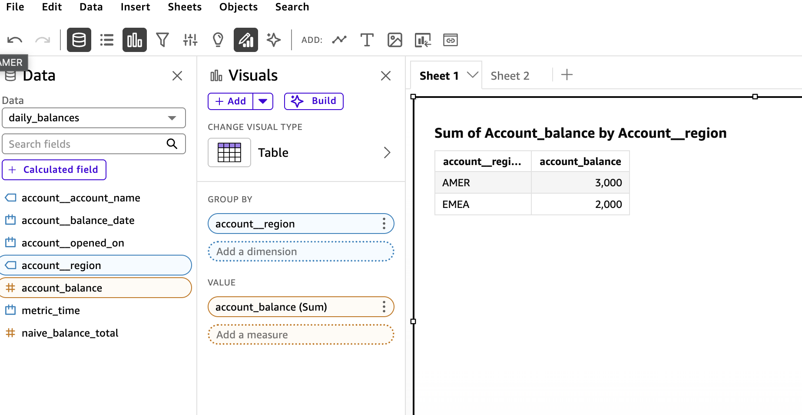

The dbt Semantic Layer is a good idea with a distribution problem. You define a metric once, in YAML, next to the models that produce it. MetricFlow compiles that definition into correct warehouse SQL, joins and all. And then you go to plug it into your BI tool, and the tool shrugs, because outside dbt Cloud there is no connector for it.

QuickSight cannot read it. Power BI cannot read it. Your analysts, who live in those tools all day, cannot reach the thing you built for them.

So they do what people always do when the governed path is blocked. They copy the metric logic into the BI tool by hand, where it drifts, and where a semi-additive balance quietly gets summed across thirty days into a number that is wrong by a factor of thirty. Nobody notices until a regulator does.

FlowProxy is my answer to that. The code is on GitHub at [dbose/flowproxy](https://github.com/dbose/flowproxy). This article is the build log, told roughly in the order the pieces actually got built, including the parts where I was wrong.

It started, like most of my projects do, as one line I could not stop turning over. What if the semantic layer just pretended to be a database.

## The one trick the whole thing rests on

Every BI tool on earth speaks PostgreSQL. QuickSight ships a PostgreSQL connector. Power BI ships Npgsql. The connectors are already installed, already blessed by the security team, already working.

So FlowProxy pretends to be a PostgreSQL server.

Not a real one. A very specific impersonation: it implements enough of the PostgreSQL v3 wire protocol that a BI driver believes it is talking to Postgres 15, but underneath, every query is intercepted, re-planned through MetricFlow, executed against the real warehouse, and streamed back as if it had come from an ordinary table.

The load-bearing property is this. FlowProxy never runs the client's SQL. It parses the SQL to find out which metrics and dimensions were requested, throws the SQL away, and asks MetricFlow to plan the query from the metric names. That indirection is the whole game. Because the query is rebuilt from the YAML rather than passed through, a BI tool that wraps a metric in `SUM()` cannot change what the metric means. The guardrails in git are the guardrails at runtime. There is no bypass, for anyone, ever.

```{mermaid}
flowchart LR
    QS["QuickSight / Power BI / LLM"] -->|SQL or MCP tools| FP["FlowProxy"]
    FP -->|re-plan through MetricFlow| WH[("Warehouse")]
    YML["git: sem_*.yml"] -.->|dbt parse| FP
    classDef a fill:#e3f2fd,stroke:#1565c0,color:#0d47a1;
    classDef b fill:#e8f5e9,stroke:#2e7d32,color:#1b5e20;
    class QS a;
    class FP b;
```

## Pinning a stack that moves in lockstep

Before any of that, a smaller lesson, learned early and cheaply. dbt-core, dbt-semantic-interfaces, metricflow, and dbt-metricflow are four packages that only work together in matched sets. Guess the versions and the resolver hands you a wall of conflicts.

My first attempt guessed. It was wrong. So I stopped guessing and asked the resolver what dbt-core 1.11 actually pulls, and wrote down what it said: dbt-core 1.11.12, metricflow 0.211.0, dbt-metricflow 0.13.0, dbt-semantic-interfaces 0.9.0, and dbt-duckdb 1.10.1 underneath. Those are now pinned in `pyproject.toml`, locked in `uv.lock`, and asserted at boot, so the process refuses to start on version drift rather than failing three layers deep with an unhelpful traceback an hour later. The whole thing runs on `uv`, which for an air-gapped shop means one lockfile you can vendor through the internal mirror and reproduce byte for byte.

Small thing. But in this ecosystem the version matrix is not a footnote, it is a prerequisite, and treating it as one saved me from a category of bug I would otherwise have hit over and over.

## Talking to a driver that expects Postgres

Wire-protocol emulation sounds harder than it is, and then in the details it is exactly as hard as it sounds.

The easy part is the shape. A connection opens, the client sends an SSLRequest, you decline it with a single byte, the client sends a StartupMessage, you answer with an authentication challenge, a pile of `ParameterStatus` packets, a `BackendKeyData`, and finally the `ReadyForQuery` byte that says: go ahead, ask me something. Then queries arrive tagged `Q` for the simple protocol or a sequence of `P`, `B`, `D`, `E`, `S` for the extended protocol that JDBC and ODBC drivers actually use under the hood. You reply with a `RowDescription`, some `DataRow` packets, a `CommandComplete`. I built all of this on asyncio, one state machine per connection.

The hard part is that drivers do not just run your query. Before QuickSight will show you a single table, its JDBC driver interrogates the server. What is your version. What is in `pg_catalog`. What columns does `information_schema.columns` have for this relation. It runs a dozen introspection queries that have nothing to do with data and everything to do with the driver convincing itself the server is real.

If you answer those wrong, the datasource pane is blank, and the analyst never gets to the interesting part. So a good chunk of the work was not semantics at all. It was learning what QuickSight's driver asks at connect time, and answering it the way a real Postgres would, so the handshake completes and the tables appear.

Power BI is stricter still. Npgsql runs a large composite bootstrap query against `pg_type` at connect, and expects coherent object IDs across `pg_class`, `pg_attribute`, and `pg_namespace`. I have that stubbed rather than done. QuickSight works today; Power BI is the next mountain. I would rather ship the honest version of that sentence than the marketing one.

## Following one query all the way down

It helps to watch a single request go through, because the whole design is really just this one path, run a few million times.

An analyst drags Account Balance and Region onto a chart. QuickSight turns that into `SELECT "account__region", "account_balance" FROM "daily_balances" GROUP BY 1` and sends it over the socket. The server tags it as a data query, not driver chatter. sqlglot parses it. Out come a cube name, a metric, a dimension, and, if the analyst had set the field to Sum in the QuickSight UI, an aggregate wrapper that gets peeled off and discarded, because the aggregation lives in the metric, not the SQL.

That distilled request goes to the compiler. MetricFlow plans it, renders the semi-additive window as a `MAX(balance_date)` join, walks the entity graph to reach region from the account, and runs the result in the warehouse. The rows come back in MetricFlow's own column order, which is not the order the client asked for, so the server re-projects them, wraps them in a `RowDescription` and `DataRow` packets and a `CommandComplete`, and QuickSight draws the chart. End of period balances, two regions, done.

```{mermaid}
sequenceDiagram
    participant QS as QuickSight
    participant S as server
    participant P as parser + filters
    participant C as compiler
    participant W as Warehouse
    QS->>S: SELECT region, account_balance ... GROUP BY 1
    S->>P: classify, then extract
    Note over P: cube, metric, dimension<br/>SUM() wrapper stripped
    P->>C: metrics + dims + filters
    Note over C: plan semi-additive MAX window,<br/>join account to region
    C->>W: optimized warehouse SQL
    W-->>C: rows
    C-->>S: re-project to client order
    S-->>QS: T + D rows + C
```

Every stage logs a line, `pipeline stage 1 of 3` and so on, so when something goes wrong I can follow the request from the raw bytes to the plan to the warehouse without guessing. That logging was not vanity. It is how I found the bug in the next section.

## The proof I actually cared about

Here is the test that made me trust the whole thing. It is not a protocol test. It is a numbers test.

I built a small but real dbt-core 1.11 project. Two accounts, two regions, three months of daily end-of-day balances seeded so the month-end values are round and hand-checkable. Then a semantic model with a semi-additive measure, the classic account-balance case:

```yaml
measures:
  - name: month_end_balance
    agg: sum
    expr: eod_balance
    non_additive_dimension:
      name: balance_date
      window_choice: max
```

The `non_additive_dimension` is the guardrail. It tells MetricFlow that this measure is summable across accounts but not across time. Over a month you want the last daily balance, not the sum of thirty of them.

I ran the query for real, against DuckDB, through the compiler. Grouped by month and region, `account_balance` came back as 1500, 1200, 2000 for one region and 4000, 4500, 3000 for the other. Exactly the seeded month-end values. Then I ran a deliberately naive `SUM` of the same column, and got 31,500 and 154,000 and numbers that are absurd on their face, because they add up daily snapshots that should never be added.

The two differ by roughly thirty times. That gap is the point. It means the guardrail is load-bearing: a BI tool that emits `SUM(eod_balance)` produces a materially wrong balance, and FlowProxy refuses to produce it, because the request routes through the metric definition and the metric knows better.

I assert those exact numbers in the test suite. Three ways, actually. Once directly against the compiler, once over a real TCP socket the way QuickSight would hit it, and once through the LLM path, so all three consumers are provably answering with the same arithmetic.

And this is where the test earned its keep. The very first run of the region-grouped query did not return 1050 for one region's transactions. It returned 95,550. Nowhere near.

The cause was a modeling mistake I had made without noticing. I had declared the region dimension on two semantic models at once, so when MetricFlow needed to reach region for a transaction metric, it joined transactions to the 182-row daily-balance table and fanned every transaction out across all its balance rows. A textbook fan-out double-count. The fix was proper dimensional modeling, a dedicated accounts dimension model that owns the account attributes, so there is one unambiguous join path. But the point is that a mock executor would have sailed straight past this. It would have returned some plausible-looking synthetic number and I would have shipped a silent factor-of-ninety error into a bank. Only executing real SQL against real seeded data catches a wrong number, because a wrong number looks exactly like a right one until you check it against arithmetic you did by hand.

That is the whole philosophy of the test suite, which I ended up thinking of as a pyramid. At the bottom, a wire-protocol smoke test that just checks the framing. Above it, a manifest test that confirms the registry classifies names correctly out of a real `dbt parse`. Then the golden-numbers layer, which is the one that matters, executing against DuckDB and asserting exact aggregates. Then filter translation, catalog discovery over a socket, and the MCP consistency check on top. Seventy-seven tests now. Several of them found real bugs rather than confirming happy paths, which is the only kind of test worth writing.

The DuckDB choice matters here and I want to be plain about it. DuckDB is a real dbt adapter that runs fully offline, which makes the whole test suite hermetic and air-gappable. It also means the only dialect I have actually proven is DuckDB. Snowflake and Redshift are inference. Reasonable inference, since MetricFlow renders the dialect, but inference.

## Letting analysts explore, not just query

An analyst does not type SQL. They open a tool, they see tables, they drag fields onto a chart. So a semantic layer that only answers hand-written queries is useless to the people it is meant to serve.

The model I landed on is the one Lightdash uses, and it turned out to be the only one QuickSight can support. Each dbt semantic model becomes a virtual table, a cube, in a schema called `semantic_layer`. The analyst browses to it, sees its metrics and dimensions as columns, drags what they want. QuickSight emits a `GROUP BY`, FlowProxy re-plans it, the numbers come back.

There is one subtlety I am quietly proud of. Each cube is pre-scoped to only the dimensions that are actually reachable for its metrics. So the daily-balances cube does not even show a transaction-only dimension as a column. The analyst cannot drag an invalid slice onto a chart, because the field is not there to drag. The guardrail is not an error message after the fact. It is an absence, up front.

I looked hard at the dbt Cloud pattern, where drag-and-drop becomes a `semantic_layer.query(...)` call over an Arrow Flight SQL driver. It is elegant. It is also unavailable to us, because QuickSight has no such driver and no way for an analyst to hand-author that call in the UI. Sometimes the constraint picks the architecture for you.

## The same layer, but for an LLM

Once the pipeline existed, exposing it to an LLM was almost free, and philosophically important.

dbt Labs publishes a reference MCP server with three semantic-layer tools: `list_metrics`, `get_dimensions`, `query_metrics`. Their implementation calls dbt Cloud. Mine cannot, because dbt Cloud is not in the building. So I reimplemented the same three tools, same names and shapes, against FlowProxy's own compiler, in-process.

The reason that matters is not convenience. It is governance. Because `query_metrics` calls the exact same pipeline as a wire query, an LLM gets the exact same guardrails as an analyst. It cannot sum a semi-additive balance. It cannot reach a dimension that is not on a valid join path; it gets a structured error listing the ones that are. I wrote a test that asserts the LLM path returns numbers identical to the wire path, because if those two ever diverged, one of them would be lying, and you would not know which.

An LLM with raw warehouse access is a governance hole with a chat interface. An LLM behind the semantic layer is just another well-behaved consumer. Same door, same locks.

## How the thing gets deployed, which is half the product

For a while the runtime ran `dbt parse` on boot against a mounted project. That is fine for a demo and wrong for a bank, and figuring out why was one of the more useful detours.

The problem is that parsing needs the whole dbt project and warehouse-DDL credentials, at runtime, in production. That is a lot of blast radius for a service whose only job is to answer SELECTs. And a bad YAML edit does not fail until the proxy boots, which is the worst possible place to find out.

So I split it. Producing the manifest is a CI job. Consuming it is the runtime. In between sits a versioned, integrity-checked bundle in an artifact store.

```{mermaid}
flowchart LR
    GIT["git: sem_*.yml"] --> GATE["CI validate<br/>(offline, plan-only)"]
    GATE -->|blocks broken YAML| STOP(("x"))
    GATE -->|on release| STORE[("ManifestStore<br/>s3 / gs / az / artifactory")]
    STORE -->|pull + verify| PROXY["FlowProxy"]
    PROXY -->|blue/green hot-swap| PROXY
    classDef a fill:#e3f2fd,stroke:#1565c0,color:#0d47a1;
    classDef b fill:#fff3e0,stroke:#e65100,color:#bf360c;
    classDef c fill:#e8f5e9,stroke:#2e7d32,color:#1b5e20;
    class GIT,GATE a;
    class STORE b;
    class PROXY c;
```

The CI gate is offline and plan-only. It runs `dbt parse`, then asks MetricFlow to plan every saved query and every cube, without executing anything, which needs no warehouse credentials at all. If a join path broke, or a dimension was renamed, or a metric was deleted out from under a saved query, the plan fails and the deploy is blocked. On a pull request it validates and stops there. Only on a production release does it publish the bundle. That asymmetry was a deliberate ask, and the GitHub Actions workflow encodes it directly.

The bundle carries no secrets. It has the semantic manifest, some metadata with a git SHA and a checksum and the validation report, and a profiles template that describes the shape of the warehouse connection but not the credentials. Those get injected at runtime from the secret store, the same way dbt itself resolves env vars in a profile. Credentials never touch git, never touch the bundle, never touch the artifact store.

The store abstraction is one interface over `fsspec`, so `s3://`, `gs://`, `az://`, a local file, an Artifactory URL, are all the same code path chosen by a config string. A bank points it at their internal MinIO and nothing in FlowProxy has to change.

## Swapping the manifest without dropping a connection

The runtime consumes a bundle and, when a new one lands, swaps to it live. Blue/green. It builds the new semantic layer in the background, and only when that build succeeds and validates does a single reference flip to the new version. Old connections finish on the manifest they started on. A failed build logs and keeps the current version serving, so a bad publish can never take the proxy down.

Getting there required one genuinely tricky bit of research that I want to record, because it nearly bit me.

To build a MetricFlow engine you need the dbt adapter, and to get the adapter the cleanest path runs `dbt debug` under the hood, which mutates global state in the dbt libraries. Adapter registration is not a pure function. It scribbles on module-level singletons. Which means you cannot naively rebuild two engines concurrently in one process and expect sanity. I found this in a spike, before it was load-bearing, which is the good time to find it. The swap now serializes engine construction under a lock. Discovering that early was worth more than any feature.

## It works, and here is the proof

I put it on AWS. A t3.micro running the container, pulling the bundle and a DuckDB file from S3, QuickSight connecting to it over the public internet with a password. Then I built two tables in QuickSight, the same drag-and-drop both times, and took a screenshot of each.



That is the semi-additive metric. AMER 3,000, EMEA 2,000. Note the title QuickSight gave it: "Sum of Account_balance." QuickSight applied a SUM. The number is still the end-of-period balance, because the SUM never reached the warehouse. The parser unwrapped it and MetricFlow re-planned the query through the metric definition, where `window_choice: max` says take the last value, not add them up.

Here is the same cube, same region grouping, same SUM, but dragging the naive metric instead:


AMER 408,500. EMEA 112,700. Off by more than a hundred times, because this metric really does add up every daily snapshot, which is exactly the wrong thing to do with a balance.

Two tables. Same tool, same clicks, same aggregation. One number is right and one is nonsense, and the semantic layer is the only thing that decides which. That is the whole product in a single side-by-side. An analyst cannot get the wrong number on the governed metric, no matter what their BI tool does, because the meaning was decided once in YAML and enforced at query time for everyone.

It took nine bugs after the offline rehearsal was green to get here. The DuckDB file's catalog name deriving from its basename. A missing S3 driver in the image. The catalog responders ignoring column aliases. The extended wire protocol path not handling catalog probes. A matcher that grabbed the wrong schema out of a CASE expression. QuickSight's real getColumns being a windowed subquery, then a pg_settings probe that had to return exactly one row, then the data query's own column aliases coming back mislabeled as NULL. Every one was real, and every one was found the same way: my tests modeled the logic, and the logs showed what QuickSight actually did. The gap between those two is where all the bugs lived. I now have a test that replays QuickSight's real probe sequence, which is the thing I should have built first and understood only after the eighth surprise.

## Where this honestly stands

I will not oversell the rest of it. The novel and risky parts are done and proven: the semantics, the guardrails, the wire path, the deploy model, and now the live demo. That is real.

The rest is known-shaped work that a bank would insist on before a pilot. Authentication is still trust-mode; SCRAM, per-role metric ACLs, and an audit log are designed but not built. Power BI is stubbed. I have benchmarked nothing, so every performance claim is a hypothesis, and the question of whether the wire edge should eventually be rewritten in Rust is deliberately parked behind measured triggers rather than vibes.

There are honest edges, too, the kind you only find by using the thing. QuickSight has to run in Direct Query mode, because its SPICE ingestion issues `SELECT *`, and a star has no semantic mapping. In-protocol TLS is declined; you terminate TLS at a load balancer in front. Bound parameters get rejected, so filters have to be inline literals for now. And the wide all-metrics table, the one that lets you explore across models, can express metric and dimension pairs that do not join, which fail with a guided error listing the ones that do. None of those are surprises. All of them are written down, because the difference between a demo and a tool is whether the sharp edges are documented or discovered.

Every decision along the way is recorded as an ADR in the repo, fifteen of them now, so the reasoning is auditable and not just the code. If you want to see the numbers prove themselves, the quick start builds the demo project into DuckDB and has a proxy answering `psql` in about four commands. It needs no warehouse and no cloud.

But the shape is right, and now it is not just a shape. One definition in git, reachable by every consumer, with the guardrails enforced in one place and bypassable by none. An analyst drags a semi-additive balance onto a chart in QuickSight and gets the end-of-period number, and I have the screenshot. An LLM asks the same question and gets the same number. When someone edits the YAML, a gate catches the mistake before it ships, and the fix rolls out without dropping a connection.

That was the thing I wanted to exist. Now it does. The rest is on [GitHub](https://github.com/dbose/flowproxy), warts and roadmap included.
