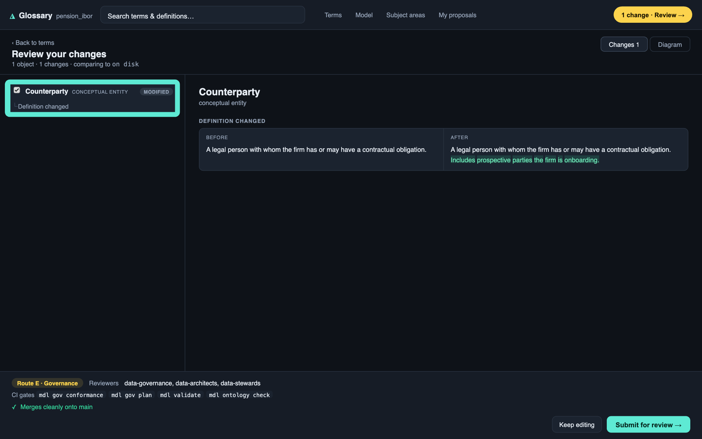
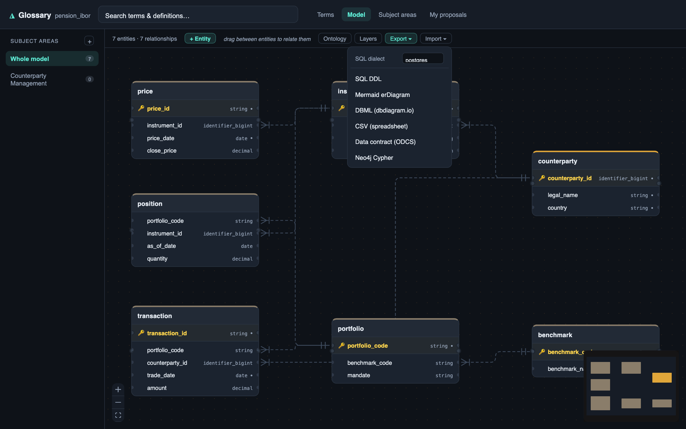

A little while ago I wrote about [Modelith](https://dbose.github.io/posts/modelith.html), a git-native data modeler that keeps the entity-relationship model and the dbt code in one repo so the diagram can never drift from the warehouse. That post made the argument: the model should be a build artifact, not a picture. Then I asked ten people to break it on their projects, and they did, and the answer to what they found was a bigger build than the original.

The first version was a modeler in your editor. What it had to become was the thing a whole team trusts, and that is a different, harder problem. Two things had to be true. The tool has to earn the right to be believed, precisely, the first time it raises its hand. And a change to the model has to be reviewable the way a change to code is, by more than one person, without anyone editing a second copy.

This post is both halves, with the commands and the output, because I did not expect either to land where it did.

I thought the hard problem was drawing the model. The hard problem was earning the right to be believed, and then letting a team change the model together without breaking that trust.

## Point it at a real warehouse and it grades itself

Most teams do not start from a blank model. They have a mature dbt project and no model at all, or a diagram so stale it is archaeology. So reverse engineering is the front door, and the front door does something slightly ruthless: the moment it reverses a warehouse into a model, the very first drift check compares that model against the same warehouse it just came from.

That is a self-check with nowhere to hide. If reversing a thing and comparing it to itself reports a breaking change, the tool has told a lie about a warehouse it had complete information on, and nothing downstream is trustworthy.

To make that concrete rather than rhetorical, the repo ships a real, runnable demo: a drug-discovery warehouse, 77 dbt models over DuckDB, 145 nodes that build clean, with real biomedical natural keys (`ensembl_gene_id`, `uniprot_id`, `chembl_id`, `mondo_id`). Here is the whole loop, top to bottom.

```bash
# 1. build the real warehouse (dbt over DuckDB) and generate the catalog
cd demo/drug-discovery/warehouse
dbt build --profiles-dir .          # seeds + models + tests: 145 nodes PASS
dbt docs generate --profiles-dir .  # writes target/manifest.json + target/catalog.json
cd -

# 2. reverse the warehouse into a governed logical model
mdl reverse \
  --project demo/drug-discovery/warehouse/target/manifest.json \
  -o /tmp/model --name drug_discovery --target duckdb_dev
```

```
reversed 52 entities (25 staging/intermediate excluded); 0 proposals pending review
  ✓ [medium-high] model 'agg_target_tractability' looks like a reporting rollup; kept unmanaged
  ✓ [medium-high] strip surrogate_key dim_gene.gene_sk from the logical view
  ✓ [medium-high] strip surrogate_key dim_compound.compound_sk from the logical view
  ✓ [medium-high] model 'dim_drug' looks like SCD2 (valid_from, valid_to, is_current)
  ... (every *_sk stripped, all 3 SCD2 dims detected, marts → unmanaged)
```

Fifty-two logical entities lifted out of seventy-seven physical models. Twenty-five staging and intermediate models excluded because they are engineer-owned by design. Every `*_sk` surrogate key stripped from the logical view. Three slowly-changing dimensions detected by the shape of their tracking columns. The `agg_*` marts recognised as reporting rollups and left unmanaged. Forty-six foreign keys recovered from the dbt `relationships` tests at high confidence. None of that is documented anywhere in the project; it is inferred.

Now the moment that matters. Drift the freshly reversed model against the warehouse it came from:

```bash
mdl drift \
  --manifest demo/drug-discovery/warehouse/target/manifest.json \
  -m /tmp/model --target duckdb_dev --check
echo "exit: $?"
```

```
drift vs target 'duckdb_dev':
  [additive] 44
    - column dim_gene.gene_sk exists in dbt but not the model
    - column dim_drug.drug_sk exists in dbt but not the model
    ... (the surrogate keys, correctly stripped from the logical view)
  [cosmetic] 13
    - column dim_compound.molecular_weight type DECIMAL(38,2) (model) vs DOUBLE (dbt)
    - column fct_drug_binding.ic50_nm type DECIMAL(38,2) (model) vs DOUBLE (dbt)
    - SCD2 system column dim_drug.mdl_scd_id is not in the dbt project yet; added on generate
    ...
exit: 0
```

Zero breaking. The `--check` flag is a CI gate that exits 2 on any breaking drift, and it exits 0. Every difference the tool reports is either additive (the surrogate keys it deliberately stripped, which are safe to re-adopt) or cosmetic (a `DECIMAL(38,2)` default versus the warehouse's `DOUBLE`, and the SCD2 bookkeeping columns the generator recreates). That is the bar. When it later says a change is breaking, on a warehouse it did not author, you have a reason to believe it.

## The two bugs the self-check caught

I did not get here by being careful. I got here by writing that self-check as a test and watching it fail, twice, on bugs I would never have found in a slide.

The first: a decimal column was being read back as a string. The SQL-type map was exact-match, and a warehouse emits `DECIMAL(18,2)`, `NUMBER(10,4)`, `VARCHAR(255)` in countless precision variants that no table can enumerate. Anything unlisted fell through to `string`, which then reported a phantom breaking type change on every numeric column the instant you drifted a reversed model against its own warehouse. The fix strips the precision and matches the family:

```python
def _base_for(sql_type: str | None) -> str:
    if not sql_type:
        return "string"
    t = sql_type.upper().strip()
    if t in _SQL_TO_BASE:              # exact match first, keeps domain overrides
        return _SQL_TO_BASE[t]
    family = t.split("(", 1)[0].strip()   # DECIMAL(18,2) -> DECIMAL
    return _FAMILY_TO_BASE.get(family, "string")
```

The second was worse, because it was silent. Drift was comparing column presence against `schema.yml` rather than the warehouse. A governed column documented in the yaml but silently dropped from the warehouse would survive in the model, and the tool would never flag it, because it trusted the documentation over the physical table. That is the exact failure a governance tool exists to prevent. The fix rebuilds the column set from the catalog, so a column that is gone from the warehouse is gone, full stop, and surfaces as a breaking `column_dropped`.

Both bugs are invisible in a demo and fatal in production. The self-check is the only reason they are fixed. The whole suite is 615 tests now, and the north-star one, reverse then drift-clean, is the one I would keep if I could keep only one.

## Reverse has to be honest, so nothing auto-decides silently

High-confidence signals auto-accept, because a foreign key that comes from a dbt `relationships` test is not a guess. But anything ambiguous is a proposal, not a decision. Run it interactively and every inference is a question you answer, and every answer is recorded in `.mdl/decisions.yaml` under git:


```
✓ [medium] hub_customer.customer_id -> dim_customer (name/type heuristic)
Accept? [medium] model 'hub_customer' looks like a Data Vault hub (y/n) [n]: y
Accept? [medium] model 'link_order_line' looks like a Data Vault link (y/n) [n]: y
Accept? [medium] dim_product.category_id -> dim_category (name/type heuristic) (y/n) [n]: y
```

The engine classifies; the human decides; the decision is versioned next to the model. A wrong inference is a one-line correction in a tracked file, not a reason to distrust the whole import. That distinction, inference you can correct versus inference you cannot, is the difference between a party trick and a tool someone runs on a Monday. The same review surface exists in VS Code as a tree grouped by kind and badged by confidence, so the accept and reject happen where the rest of the work already happens.

A dbt manifest is not the only way in. A pile of raw SQL DDL goes through the same engine: paste it, pick a dialect, and it parses the `CREATE TABLE` statements, reads the primary and foreign keys, then hands the result to the exact same classification and review flow. A declared foreign key in the DDL comes through as a high-confidence relationship, the way a dbt `relationships` test does.


So a team with no dbt manifest, just a schema dump from an old database, gets the same surrogate stripping, the same relationship recovery, and the same review ledger. There is one front door, and it does not care whether you arrived from dbt or from raw SQL.

## The drift alarm reads like a code review, not a diff

A diff that says "142 things changed" is noise. The value is in the classification, and in explaining it where a human is already looking. The `@modelith` chat participant answers a drift question in plain language, grounded in the manifest, with the impact and the remediation spelled out:


One breaking change, named, with its blast radius and what to do about it. One additive change, named, safe to fold in. That separation is the product. It is the difference between catching an incident on a branch and catching it in production. The diagram was never the point. The alarm is the point.

The same participant answers modeling questions, and the part I care about is what it does when it does not know. Ask it to define keys for an entity and it proposes a composite key from the model, then flags that all three attributes are nullable and that it cannot confirm the combination is unique:


Ask it whether every model is in Boyce-Codd normal form and it gives a per-entity table, but leads with the honest caveat that a full proof is impossible because the model does not record functional dependencies, and marks the one entity with no key as unassessable rather than inventing an answer:


The engine classifies and the assistant explains, grounded in the model, and it fails closed to what the deterministic layer actually knows. An assistant that confidently makes up a normal-form proof is worse than no assistant, because it launders a guess as a fact. This one refuses to.

## And it can anchor the model to a shared vocabulary, live

A logical model in isolation still lets two teams call one concept two names, and two concepts one name. So Modelith aligns entities to an ontology, and it discovers the ontology live rather than bundling a stale copy. Declare a source and it hits the EBI Ontology Lookup Service directly, no API key:

```yaml
ontology_stack:
  - type: ols
    name: ols
    layer: industry
    url: https://www.ebi.ac.uk/ols4/api
    ontologies: [mondo, efo, go, hp]
```

```bash
mdl ontology search diabetes -m demo/drug-discovery/model --limit 5
#   MONDO:0005148  [ols]  type 2 diabetes mellitus, characterized by insulin resistance …
#   MONDO:0011668  [ols]  maturity-onset diabetes of the young, caused by NEUROD1 …
```

In the canvas the same search is a modal that returns live-tagged results you align with a chosen predicate:


The alignment lands in the entity's YAML as a real reference, not a wiki note:

```yaml
name: Disease
ontology_layer: industry
ontology_refs:
  - uri: MONDO:0005148
    predicate: skos:closeMatch
    resolved_via: ols4
```

If `counterparty` in one model and `counterparty` in another both resolve to the same term, they mean the same thing by construction, not by a data steward's memory. In the drug-discovery demo, seven entities align this way: Disease to MONDO, Gene and Variant to SO, Pathway to GO, Phenotype to HP, Protein to PR, Drug to CHEBI.

This is not biomedical-only. Point it at FIBO for a financial model and the same browser returns FinancialInstrument, FinancialTransaction, and Position with their definitions, from the same source-tagged search:


The terms are first-class in the editor too, not just the canvas. The Modelith language server autocompletes an ontology URI as you type it, with the term's definition inline, so aligning an entity is a completion rather than a copy-paste from a spec you had open in another tab:


An entity can carry more than one alignment, and those alignments are themselves governed. The inspector shows an accepted reference next to a proposed one, each with its predicate and its provenance, so a term coming from a Collibra sync is a proposal a steward promotes, not a silent overwrite:


Accepted versus proposed, with the source recorded, is the same pattern as the reverse review ledger: nothing about meaning changes silently, and every alignment is a decision someone made on the record.

## A model a team changes together, not a file one person owns

Everything above is about trust. The other half of what got built is about collaboration, because a model that only one engineer can safely change is not a governed artifact, it is a private one.

So the model now has its own application, `mdl studio`, with two front doors onto the same repo. An architect gets a full structural canvas: create entities, draw a relationship in one gesture and have the foreign-key column created for you, edit a relationship from its edge, all validated live. The header carries a valid badge because the model is checked as you edit, not at commit time.


The subject-matter expert gets the other door: a browser-side glossary, no editor, where they review terms and definitions and edit the meaning without touching YAML. Same model, same repo, same git history. The modeler and the expert are never editing two different things.

Here is the part I am proud of. Neither persona writes to the model directly. Every change is staged, and submitting it opens a real pull request, on GitHub, GitLab, or any git host, built from the remote rather than scraped from push output. A definition edit becomes a branch, a title, a reviewer note, and a set of reviewers, chosen by what the change actually touched:

![The Submit for review dialog in Studio. A definition change is shown as a redline diff, attributed to the signed-in author, with an editable branch name (sme/debasish-bose/update-definition), a reviewer note field, and a routing notice explaining that because the change spans routes A and E it will be reviewed as route E, Governance, needing data-governance, data-architects, and data-stewards plus an ontology check, with a hint that proposing the meaning-only changes separately would be reviewed faster.](images/modelith-propose.png)

That routing notice is the semantic merge engine talking. Modelith diffs two versions of the model by meaning, not by text, and sorts each change into a route: a definition change is a different kind of thing from a structural change, which is a different kind of thing from a governance change, and the strictest gate wins. So the tool can tell you, before you submit, that splitting your meaning-only edits from your structural ones would clear review faster. A text diff cannot say that. A meaning-aware one can.

The SME's side of that same flow shows the before-and-after and the gates it will face:



Underneath all of it is the plumbing a real team needs and a demo skips: an identity seam that plugs into your own IdP, a write-gate that can require authentication before anything is proposed, and an OpenTelemetry-native audit log of who changed which meaning, when. Subject areas keep a large model navigable in scoped views instead of one wall of tables. None of this is glamorous. All of it is the difference between a tool one person uses and a tool an organisation adopts.

And because the model stays the single source, everything downstream is a generated projection of it. The same model exports as SQL DDL in a chosen dialect, a Mermaid diagram, DBML, a CSV, an ODCS data contract, Pydantic models, a MetricFlow semantic layer, or Neo4j Cypher:



Every one is derived from the same YAML that generates the dbt project, so none is a second source of truth that can quietly disagree with the first. That was the whole thesis of the first post. This is that thesis with a review process wrapped around it.

## What I am looking for now

I have taken this about as far as one person and a lot of real dbt projects can. The concept holds, the trust bar is where I want it, and the next stretch is not a solo problem. So I am opening it in three directions.

Design partners. I want six to ten teams running dbt in production at real scale who feel the drift and stale-documentation pain personally. The offer is me doing work for you, not you evaluating a tool: I will reverse-engineer your project into a governed model and stand up a drift gate in your CI, live, in one session, free, in exchange for your honest reaction and a few follow-ups over a month. I would rather learn where it breaks on your warehouse than keep being right on mine.

Investors. There is a category forming under the surface here, the trust and governance layer between the modeling tools nobody opens and the transformation code everyone lives in. If you back data infrastructure and developer tools, and the model-as-a-build-artifact thesis resonates, I would value the conversation, including the sceptical version of it.

Collaborators. This is early and open. The semantic merge engine, dbt internals, the Studio surfaces, making inference explainable rather than magical: there is real work here with real edges, and I would rather build the next part with people who will push on it than ship it in silence.

## The through-line

The first post argued that the model should be one artifact with the code, under one history, so the diagram cannot lie. Building it out sharpened the argument in two directions. It is not enough for the model to be honest about the past; it has to be trustworthy about the present, precisely enough that when it says a change is breaking, you move. And it is not enough for the model to be one artifact; it has to be an artifact a team can change together, through review, without anyone forking a private copy.

That is the whole thing. Define meaning once, put it where the build can reach it, make the tool clean enough against itself that people believe it the first time it raises its hand, and wrap every change to it in a review a team actually runs.

The repository, and the runnable demo behind every number in this post, is at [github.com/dbose/modelith](https://github.com/dbose/modelith). The extension is live on Open VSX, so it installs directly in VS Code, Cursor, Windsurf, and VSCodium: search "Modelith". Whether you want to break it on your project, fund the next stretch, or build it with me, I would genuinely value your eyes on it.
